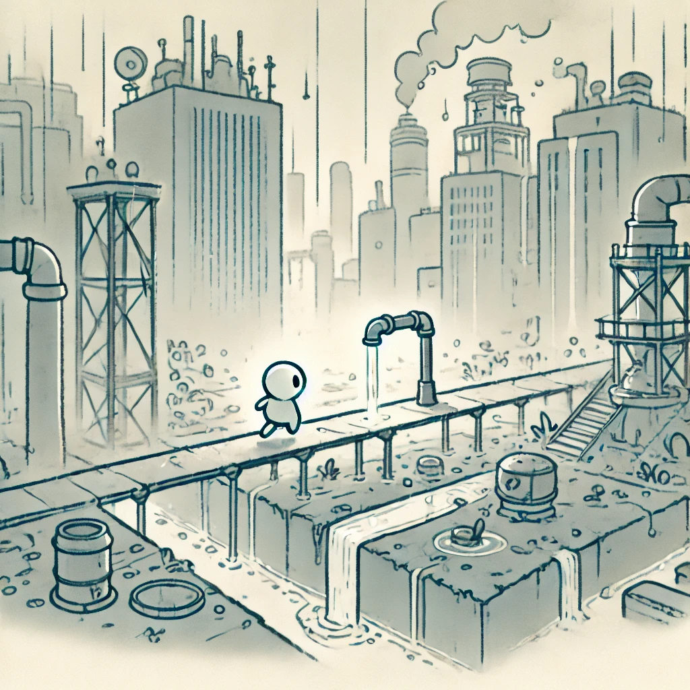
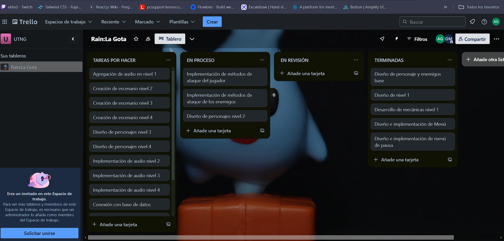

# Creacion de Videojuegos

    

<h5 align="justify">
Repositorio donde se almacena el videojuego creado para la materia de "Creacion de Videojuegos ING", de Oscar Iván Pérez Mejía y Abraham Salvador Espinoza Gómez del Grupo GIDS4102-E.
</h5>

## Contenido

- [Introducción](#introducción)
- [Planificación](#planificación)
- [Autores](#autores)
- [Copyright](#copyright)

## Introducción

### Personaje

Rain la gota

#### Objetivo.

Un juego de plataformas en 2D donde el jugador deberá atravesar diferentes niveles llenos de enemigos y obstáculos para el concentimineto del desperdicio del agua. 

- Plataforma: 2D
- Género: Plataforma, Fantasía, Acción
- Clasificación: E (Aptop para todo público)

#### Idea del videojuego.

El jugador se encarga del control de una pequeña gota de agua, la cual se debe encargar de atravesar distintos niveles mientras trata de conservar la mayor cantidad de agua posible. A lo largo del camino, se enfrentará a enemigos que representan el desperdicio de agua, y obstáculos que la desgastan lentamente. El objetivo de la gota será llegar a un lugar seguro en el cual pueda descansar sin preocupaciones, lo que sería la representación de una laguna o algún sitio que represente la naturaleza. Además, a lo largo del camino se encontrará con algunos elementos y amigos que le permitan avanzar en su camino a este lugar seguro, estos serán elementos o acciones que sirvan de conciencia de cuidar el agua.

### Historia

En el mundo el agua es un recurso que es cada vez más escaso, debido al crecimiento de la civilización y su conquista el equilibrio de la naturaleza ha comenzado a verse alterado. Tanto ciudades, fábricas o campos han comenzado a consumir el agua de manera desmedida sin importar el uso de esta, esto ha logrado que  ríos, lagos y lagunas están en peligro de desaparecer. Los desechos, la contaminación y el mal uso del agua están poniendo en riesgo el futuro de todos los seres vivos. Pero, incluso en medio del caos, hay una pequeña gota de esperanza.
En las alturas del cielo, al nivel de las nubes, nace Rain, una pequeña y valiente gota de agua. Su hogar, una hermosa laguna en lo profundo de la naturaleza, está en peligro de secarse por completo debido a la contaminación y el desperdicio que ocurren a su alrededor. Rain la gota debe emprender un viaje peligroso para salvar su hogar llevando lluvia a este lugar y con esto restaurar el equilibrio del agua.

### Esenarios

En Rain: Guardian de las Gotas los escenarios representan el camino que sigue nuestro protagonista Rain para poder llegar a su destino y cumplir con su misión, cada uno de estos contiene sus propios elementos acordes al tipo de entorno en el que nos encontramos yendo desde escenarios lúgubres hasta escenarios un poco más relajantes conforme el final se acerca, cada uno de estos al representar el viaje de Rain no quiere decir que serán más fáciles según se avanza sino que se va mejorando el destino para lograr su misión en cada uno encontraremos distintos desafíos que pongan a prueba las habilidades del jugador.

## Planificación

[Trello](https://trello.com/invite/b/671c3aa09adf0312d37d75d9/ATTI4aca0fdf429b3a3650870b9f90c1dd859D3C52D8/rainla-gota)

## Autores

[Oscar Iván Pérez Mejía](https://github.com/osipzmj) y [Abraham Salvador Espinoza Gómez](https://github.com/Abrahames0)

## Copyright

Derechos Reservados con fines educativos 2024
